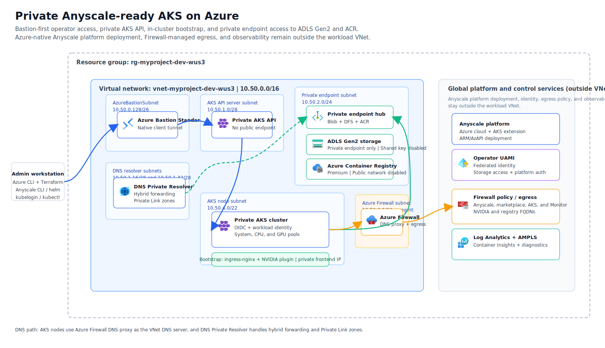

# Private AKS foundation for Anyscale on Azure

This repository builds a private Azure landing zone for running Anyscale on AKS. The stack creates the network, Azure Bastion host, Azure Firewall egress path, DNS Private Resolver, private AKS cluster, private storage account, private Azure Container Registry, Log Analytics and Container Insights wiring, and the user-assigned managed identity that the Anyscale operator uses for Azure data-plane access. It also includes the shell workflow that turns a private cluster into something an operator can deploy, validate, and prove with deterministic workloads from a local machine without exposing the Kubernetes API publicly.

This is an infrastructure and operator workflow repository, not an application repository and not a self-hosted Anyscale control plane. The cluster runs the operator and workloads, while the Anyscale console remains SaaS-hosted at `https://console.azure.anyscale.com`.

## Architecture



The editable source for the diagram is `docs/architecture.drawio`. If you change it, regenerate the checked-in SVG with `bash scripts/export-diagrams.sh`.

## What this deployment creates

Phase 1 creates the Azure foundation: the resource group, VNet, Bastion subnet, AKS API server subnet, AKS node subnet, private endpoint subnet, DNS Private Resolver subnets, Azure Firewall subnets and policy, the private AKS cluster with system, CPU, and GPU pools, the private storage account, the private Premium ACR, the operator managed identity and federated identity wiring, and the observability resources. Phase 2 finishes the Kubernetes side of the deployment by applying the Terraform-managed bootstrap layer through a Bastion-backed kubeconfig, deploying the Azure-native Anyscale cloud resources through AzAPI, and installing the AKS marketplace extension through the native `azurerm_kubernetes_cluster_extension` resource so the existing AKS cluster, storage account, registry, and operator identity are bound into the Anyscale platform flow.

The result is intentionally opinionated. AKS stays private, the storage account and ACR stay private-only through Private Link, node egress is forced through Azure Firewall, DNS resolution follows the same enterprise path that the firewall enforces, and local Kubernetes access is Bastion-first.

## Prerequisites

You should assume this README is the only document you need to get a fresh environment running, so start by making sure the local workstation, Azure permissions, and Anyscale inputs are in place before you deploy.

For the local workstation, work from a macOS or Linux shell with Git, Azure CLI, Terraform `>= 1.9.0`, `kubectl`, `kubelogin`, `helm`, `jq`, `rsync`, Python `3.9+`, and `uv` installed. The private-cluster workflow also requires the Azure CLI `aks-preview` and `bastion` extensions. If you want to regenerate the architecture preview, install the draw.io or diagrams.net CLI as well.

For Azure access, you need to be able to log in to the target tenant and subscription and create the full set of resources this stack uses: networking, Azure Firewall, Azure Bastion, AKS, Private Link, storage, ACR, Log Analytics, managed identities, federated identity credentials, RBAC assignments, and the Anyscale marketplace resources. The sample configuration assumes GPU quota for `Standard_NC16as_T4_v3` in the target region because the validated path keeps one T4 node warm for GPU workspace and workload proof bring-up.

For Anyscale access, `ANYSCALE_CLI_TOKEN` is required before `deploy` starts. The token is treated as organization-scoped for this workflow, so the script no longer pauses mid-run for a token. The repo-local CLI binary is expected at `.venv/bin/anyscale`.

## Start from a fresh clone

After cloning the repository, work from the repository root and create a local `.env` from the committed template.

```bash
cp .env-template .env
```

Fill in the Azure subscription and tenant IDs, naming and region values, VNet and subnet CIDRs, outbound allowlists, ownership tags, and any AKS/GPU sizing changes you need. The defaults are opinionated on purpose: they pin AKS to `1.34.6`, keep the GPU pool at `min_count=1`, enable Azure Monitor diagnostics, and default the operator identity mode to `{"mode":"create"}`.

In the Anyscale section, set `ANYSCALE_CLI_TOKEN` before deployment. `ANYSCALE_CLOUD_NAME` is derived when blank, and `ANYSCALE_CLOUD_DEPLOYMENT_ID` is discovered from the live Azure platform deployment. The default Terraform authentication path is `ARM_USE_CLI=true`, which means the wrapper assumes a normal local `az login`. If you need service principal, OIDC, or managed identity auth instead, the commented `ARM_*` settings in `.env-template` are the place to start.

Before you deploy anything, source the environment file for convenience and authenticate Azure CLI against the target tenant.

```bash
source .env
az login --tenant "$TF_VAR_azure_tenant_id"
```

The wrapper renders `infra/terraform/terraform.auto.tfvars.json` from `.env` automatically during deployment and validation. That generated file is ignored by Git.

## Install the repo-local Anyscale CLI

Create the repo-local virtual environment before deploy so the orchestrator can register compute configs, workspaces, and workload proof commands through the same CLI version.

```bash
uv venv .venv
source .venv/bin/activate
UV_CACHE_DIR="$PWD/.cache/uv-cache" uv pip install --python .venv/bin/python anyscale
```

You can still run `.venv/bin/anyscale login` for ad hoc manual exploration, but the repository automation reads `ANYSCALE_CLI_TOKEN` from `.env` and fails fast when it is missing.

## Deploy, verify, and prove workloads

The visible operator surface is intentionally small:

```bash
./scripts/setup.sh deploy --from-scratch --yes
./scripts/setup.sh verify --full
./scripts/setup.sh workload proof all
```

For deployment, teardown, validation, workload proof, and repeatability,
`scripts/setup.sh` is the primary shell entry point. The remaining top-level
shell scripts are intentionally narrow: `scripts/test-timeouts.sh` is the
timeout-library self-test, and `scripts/export-diagrams.sh` only regenerates
documentation assets.

`deploy --from-scratch --yes` force-deletes the configured resource group if it exists, clears local Terraform state artifacts, runs static Terraform validation, creates the Azure foundation, opens Bastion-backed private AKS access, applies the Kubernetes bootstrap and Azure-native Anyscale resources, installs the AKS extension, registers `aks-cpu` and `aks-gpu`, creates or reuses `aks-cpu-workspace` and `aks-gpu-workspace`, starts both workspaces, and checks warm CPU/GPU workers on the expected AKS node pools.

Plain `deploy` is the idempotent reconciliation command to rerun after changes. It skips the initial cleanup, reuses the target AKS cluster when it already exists, and reconciles the platform and workspace stages.

Each run writes console progress and per-stage logs under `.cache/aks-anyscale-sample-harness/runs/<timestamp>-<command>/`, with a `summary.md` and `stages.tsv` for easy inspection.

`verify --full` runs the static Terraform checks and then the live health/focused validation path through Bastion. Use `verify --static` for local configuration checks only, or `verify --live --skip-observability` when Log Analytics ingestion is not ready yet.

`workload proof all` pushes deterministic Ray scripts from `workloads/proofs/` into the durable CPU and GPU workspaces and executes them there. The CPU proof computes squares for rows `0..15` and must print `CPU_RAY_PROOF_OK`; the GPU proof requires a Ray task with `num_gpus=1`, verifies `CUDA_VISIBLE_DEVICES`, computes cubes for rows `0..7`, and must print `GPU_RAY_PROOF_OK`. The command collects Anyscale workspace logs plus AKS pod, operator, container, and event diagnostics into the run directory.

For repeatability testing, use the built-in idempotency harness:

```bash
./scripts/setup.sh idempotency
```

By default it runs deploy, verify, and workload proof twice, then requires a Terraform no-op plan. Destructive cleanup is opt-in with `--include-teardown` or `--include-force-teardown --i-understand-this-deletes-azure-resources`.

## How private AKS access works in this repository

This repository assumes local operator access is Bastion-first. The direct `az aks get-credentials` path is not enough because the downloaded kubeconfig points at the private AKS API hostname. Without Bastion, the local machine has no route to that endpoint.

The setup orchestrator owns that private access path. `deploy`, `verify --live`, and `workload proof ...` start or reuse the Bastion tunnel, write a Bastion-backed kubeconfig under `.cache/`, and point Terraform, `kubectl`, `helm`, and diagnostics at the local listener. The helper state lives under `.cache/aks-anyscale-sample-harness/`, which is ignored by Git.

The browser path for private Anyscale workspaces is intentionally not part of the supported four-command UX. During validation, direct Ray Dashboard forwarding worked as a troubleshooting fallback, while the Anyscale browser auth path remained blocked by an upstream `400 Invalid host: login.microsoftonline.com` response after the Microsoft Entra callback. Keep browser experiments in local notes and support artifacts rather than in the primary deployment workflow.

## Workspaces and workload proof

`deploy` owns the Anyscale operator reconciliation and the durable workspace registration. It ensures the AKS-compatible declarative compute configs `aks-cpu` and `aks-gpu` exist, then creates or reuses `aks-cpu-workspace` and `aks-gpu-workspace`. Each worker group uses `required_resources` plus AKS node selectors and tolerations so the scheduler places CPU workers on `aks-cpu-*` nodes and GPU workers on `aks-gput4-*` nodes.

Existing compute configs and workspaces with the same names are reused, so `deploy` is safe to rerun. If a sample workspace points at an older compute-config version, the orchestrator terminates it, updates the compute config, starts it again, waits for `RUNNING`, and validates that a warm worker is online on the expected AKS pool. Generated compute-config YAML and workspace logs are written under `.cache/` and the active run directory.

After deployment, run the deterministic workload proof:

```bash
./scripts/setup.sh workload proof all
```

Use `workload proof cpu` or `workload proof gpu` when you only need one side. The proof command starts or reuses the target workspace, pushes the scripts under `workloads/proofs/`, runs them in the workspace through the Anyscale CLI, checks the expected success marker, and collects diagnostics under `.cache/aks-anyscale-sample-harness/runs/<timestamp>-workload-*/diagnostics/`.

The generated diagnostics include Anyscale workspace log tails and downloadable workspace logs when available, plus AKS workspace pod listings, pod descriptions, operator logs, workspace container logs, and namespace events. That gives first-run failures enough context to debug either the Anyscale layer or the Kubernetes scheduling/runtime layer.

You can still use the Anyscale console for manual inspection. The expected end state is that `aks-cpu-workspace` and `aks-gpu-workspace` are `RUNNING`, `aks-cpu-workspace` can run Ray CPU tasks, and `aks-gpu-workspace` can run Ray tasks requiring `num_gpus=1` with `CUDA_VISIBLE_DEVICES` set.

## Using custom Ray images

Anyscale only supports customizing the Ray container image for workload pods, you cannot customize the other sidecars today.

The private ACR created by `module.acr` has `public_network_access_enabled = false` and is reachable only through its private endpoint inside the workload VNet, so `docker push` from a local workstation cannot reach it. The supported path for landing a Ray image in the private ACR is `az acr import`, which copies the image directly between the source registry and ACR over the Azure control plane and does not require any data-plane network access from your workstation.

A typical import of a public Anyscale Ray image looks like this:

```bash
ACR_NAME=$(terraform -chdir=infra/terraform output -raw acr_login_server | cut -d. -f1)
RG=$(terraform -chdir=infra/terraform output -raw resource_group_name)

az acr import \
  --name "$ACR_NAME" \
  --resource-group "$RG" \
  --source docker.io/anyscale/ray:2.55.1-slim-py312-cu129 \
  --image anyscale/ray:2.55.1-slim-py312-cu129
```

If the import returns a `429` or `toomanyrequests` error from the source registry, pass Docker credentials with `--username <user> --password <token>` (a Docker Hub Personal Access Token works) to retry against the authenticated quota instead of the anonymous per-IP bucket.

After the import completes, the image lives inside the private VNet at `<acr_login_server>/<image>:<tag>`. For the example above that resolves to a URI of the form:

```
<acr_login_server>/anyscale/ray:2.55.1-slim-py312-cu129
```

Confirm the upload with `az acr repository show-tags --name "$ACR_NAME" --repository anyscale/ray`. The AKS kubelet identity already has `AcrPull` on this registry (wired in `infra/terraform/main.tf`), so workspaces and workloads can reference the URI directly with no `imagePullSecret`. Point the Anyscale workspace or compute-config container image setting at that URI to roll out the custom Ray image.

## Validate the codebase and the deployed environment

There are three validation levels in this repository. `verify --static` runs formatting, Terraform validation, and the plan-time Terraform tests. `verify --live` checks the deployed Azure, AKS, Anyscale operator, workspace, and focused Kubernetes path through Bastion. `verify --full` runs both.

```bash
./scripts/setup.sh verify --static
./scripts/setup.sh verify --live --skip-observability
./scripts/setup.sh verify --full
```

The live path writes per-check logs plus a summary under the run directory. It verifies private AKS API reachability, Azure resource state, operator rollout, workspace readiness, private DNS and firewall-routed egress, Workload Identity storage access, internal ingress reachability, GPU scheduling, and observability when enabled.

For a deeper Terraform-only apply test, run the native test directly from the Terraform root. It provisions the phase-1 resource shape, asserts outputs and private-mode invariants, and destroys those test resources when the test ends.

```bash
cd infra/terraform
terraform test -filter=tests/apply.tftest.hcl -verbose
```

`./scripts/test-timeouts.sh` is also available when you want to validate the timeout wrapper itself without waiting on Azure, Bastion, or Terraform.

## Success criteria for a bring-your-own AKS integration

This repository provisions its own AKS cluster today, but the same integration pattern can be used as the acceptance bar for a bring-your-own AKS variant. If you want to bring an existing AKS cluster with one CPU node pool and one GPU node pool into this Anyscale flow, the integration should only be considered successful when all of the following are true:

- The target AKS cluster is reachable through the Bastion-backed access path and, in addition to whatever system pool AKS itself requires, exposes one schedulable CPU node pool and one schedulable GPU node pool with the expected selectors, taints, and NVIDIA device availability.
- `./scripts/setup.sh deploy` completes without manual portal repair work, and the Azure-native Anyscale cloud resource plus the `anyscaleoperator` AKS extension both reach `Succeeded`.
- `./scripts/setup.sh verify --full` passes, proving private API access, firewall-routed egress, Workload Identity storage access, internal ingress reachability, GPU scheduling, workspace readiness, and observability when enabled.
- The deploy stage registers the `aks-cpu` and `aks-gpu` compute configs, registers `aks-cpu-workspace` and `aks-gpu-workspace`, starts both workspaces, waits until they reach `RUNNING`, and confirms warm CPU and GPU worker pods are online on the expected node pools.
- `./scripts/setup.sh workload proof all` passes and emits both `CPU_RAY_PROOF_OK` and `GPU_RAY_PROOF_OK` from the durable workspaces.
- The end-to-end path is repeatable: rerunning `deploy`, `verify --full`, and `workload proof all` reuses existing durable infrastructure and returns the same deterministic markers.

## Inspect the environment during and after deployment

Every `deploy`, `verify`, `workload`, and `teardown` run writes a timestamped directory under `.cache/aks-anyscale-sample-harness/runs/`. Start with that run directory when you need to inspect state: `summary.md` gives the stage overview, `stages.tsv` is machine-readable, and `logs/` contains the raw command output for each stage. Workload runs also include a `diagnostics/` tree with Anyscale workspace logs, AKS pod descriptions, operator logs, container logs, and Kubernetes events.

## Operational tooling

The notes below focus on how the extra tools were installed locally, what they are for, and how they were used against this private AKS deployment. Keep one-off session transcripts or detailed operator notes in a local root `ISSUES.md`; that file is gitignored in this repository.

### AKS MCP for Copilot Chat and GitHub CLI

`aks-mcp` exposes AKS-aware MCP tools so Copilot Chat, the `copilot` CLI, and `gh copilot` can inspect AKS metadata and cluster-adjacent state without relying only on ad hoc shell commands.

Install the macOS `darwin-arm64` release binary somewhere on `PATH`:

```bash
curl -L -o "$TMPDIR/aks-mcp.tar.gz" \
   https://github.com/Azure/aks-mcp/releases/download/v0.0.17/aks-mcp-darwin-arm64.tar.gz
tar -xzf "$TMPDIR/aks-mcp.tar.gz" -C "$TMPDIR"
install "$TMPDIR/aks-mcp-darwin-arm64/aks-mcp" /opt/homebrew/bin/aks-mcp
```

This repository intentionally gitignores the local MCP client configuration files, so create them only on your workstation. Copilot Chat in VS Code reads `.vscode/mcp.json` and the `copilot` / `gh copilot` CLIs read `.mcp.json`.

```json
{
   "servers": {
      "aks": {
         "type": "stdio",
         "command": "aks-mcp",
         "args": ["--transport", "stdio"]
      }
   }
}
```

```json
{
   "mcpServers": {
      "aks": {
         "type": "stdio",
         "command": "aks-mcp",
         "args": ["--transport", "stdio"],
         "tools": ["*"]
      }
   }
}
```

Verify the local registration with:

```bash
copilot mcp get aks
gh copilot -- mcp get aks
```

### AKS Agentic CLI

The preview `aks-agent` Azure CLI extension is the Azure-native agent surface for AKS diagnostics and guided investigation flows.

```bash
az extension add --name aks-agent --upgrade
az aks agent --help
```

During this validation session the extension installed cleanly and the command surface was available, but Docker was not installed on the local macOS workstation, so the containerized client mode was not exercised further.

### Inspektor Gadget

Inspektor Gadget adds live Kubernetes and kernel troubleshooting helpers such as process snapshots, DNS inspection, and network tracing. In this repository it was used through the Bastion-backed kubeconfig that the orchestrator writes under `.cache/` during live validation and workload proof runs.

Install `krew` if needed, then install and deploy the gadget plugin:

```bash
kubectl krew install gadget
kubectl-gadget deploy --timeout 4m
```

In this environment the direct `kubectl-gadget` binary under `$HOME/.krew/bin/` was more reliable than plugin discovery through `kubectl gadget`, so prefer the direct command when you want reproducible output.

## Tear the environment down

Use `teardown` when you want Terraform to delete the deployed resources in the normal way.

```bash
./scripts/setup.sh teardown
```

The command asks you to type the project name from `.env` before it proceeds, stops any running Bastion tunnel, runs `terraform destroy`, and clears the cached Anyscale cloud deployment ID from `.env`.

When `anyscale_platform.enabled=true`, `terraform destroy` includes a pre-destroy Anyscale cloud teardown hook. The hook runs before the AKS extension, AKS cluster, and resource group are torn down, terminates jobs, services, workspaces, and backing cluster sessions in the current cloud, and then issues the Azure `Anyscale.Platform/clouds` delete while the backing resources still exist.

If that hook cannot drain the current cloud, `terraform destroy` stops early on purpose so the AKS/operator resources are still present for inspection instead of leaving the cloud in the older wedged state. The default knobs are exposed under `anyscale_platform.teardown`, and `destroy_workaround` remains accepted as a legacy input alias. The hook can be disabled explicitly with `TF_VAR_anyscale_platform='{"teardown":{"enabled":false}}'`.

Use the force path when you need a full reset after a failed private-cluster experiment and want Azure CLI to delete the resource group directly before removing local Terraform state and saved plan files.

```bash
./scripts/setup.sh teardown --force --yes
```

The force path is intentionally stronger than Terraform-backed teardown. It waits for the resource group deletion to finish, removes local Terraform state and plan files, keeps `.env` and `.terraform.lock.hcl`, and leaves you ready to run `./scripts/setup.sh deploy` again.

### Retire legacy Anyscale clouds on Azure

If old Anyscale clouds or workspace records remain after you have moved on to a newer deployment, use the sequence below. This is the exact cleanup path that was exercised against older `anyscaleb2-*`, `anyscaleb3-*`, and `anyscalebb-*` Azure-backed clouds during the May 2026 validation session.

1. Inventory every workspace across every visible cloud and terminate the workspace records first:

   ```bash
   set -a; source .env; set +a
   .venv/bin/anyscale workspace_v2 list -j --no-interactive --include-archived --max-items 500 \
     | jq '[.[] | {name,id,state,cloud_id,project_id}]'
   ```

   Then terminate each non-terminated workspace by ID:

   ```bash
   .venv/bin/anyscale workspace_v2 terminate --id <workspace-id>
   ```

2. Inspect the cloud inventory and probe cloud-level cleanup hooks:

   ```bash
   .venv/bin/anyscale cloud list -j --no-interactive --max-items 100 \
     | jq '[.[] | {id,name}]'

   .venv/bin/anyscale cloud status --id <cloud-id> -o .cache/<cloud-id>.status.yaml
   .venv/bin/anyscale cloud terminate-system-cluster --id <cloud-id> --wait
   ```

   In the validated Azure cleanup flow, the old clouds returned `No system cluster found`, which ruled out the system-cluster path as the deletion blocker.

3. Try the Anyscale CLI cloud delete command, but expect the Azure limitation:

   ```bash
   .venv/bin/anyscale cloud delete --id <cloud-id> --yes
   ```

   On Azure this currently fails with:

   ```text
   Error: `cloud delete` is not supported on Azure, see https://docs.anyscale.com/azure#limitations
   ```

4. Fall back to Azure Resource Manager and delete the `Anyscale.Platform/clouds` resource directly:

   ```bash
   az resource delete --ids \
     "/subscriptions/<sub>/resourceGroups/<rg>/providers/Anyscale.Platform/clouds/<cloud-name>"
   ```

   If ARM returns a `409` stating the cloud still has associated clusters, capture the cluster IDs from that error. That means the workspace records are not the only remaining blocker.

5. Enumerate the active Anyscale clusters in every project:

   ```bash
   set -a; source .env; set +a
   .venv/bin/anyscale cluster list --include-all-projects --include-inactive --include-archived --max-items 200
   ```

   The currently shipped CLI exposes `cluster archive`, but in this environment that command raised `AttributeError: 'DefaultApi' object has no attribute 'archive_cluster'` and could not be used to clear the blockers.

6. Use the installed controller directly from the repo virtualenv to send cluster terminate requests by cluster ID:

   ```bash
   set -a; source .env; set +a
   .venv/bin/python - <<'PY'
   from anyscale.controllers.cluster_controller import ClusterController

   ClusterController().terminate(
       cluster_name=None,
       cluster_id="<cluster-id>",
       project_id="<project-id>",
       project_name=None,
       cloud_id=None,
       cloud_name=None,
   )
   PY
   ```

   To poll the exact cluster state without relying on the broken public archive path:

   ```bash
   set -a; source .env; set +a
   .venv/bin/python - <<'PY'
   from anyscale.controllers.cluster_controller import ClusterController

   cc = ClusterController()
   cluster = cc.api_client.get_decorated_cluster_api_v2_decorated_sessions_cluster_id_get("<cluster-id>").result
   print(cluster.id)
   print(cluster.state)
   PY
   ```

7. If those cluster states remain `Running` or `StartingUp` even after direct terminate requests, stop retrying ad hoc commands and preserve an incident bundle for support. The local bundle captured during validation used this layout under `.cache/anyscale-cloud-cleanup-<timestamp>/`:

   - `workspaces.before.json` and `workspaces.after.json`
   - `<cloud-id>.status.before.yaml` and `<cloud-id>.status.after-terminate.yaml`
   - `azure-cloud-resource-ids.txt`
   - `run.log`

The validated outcome on Azure was:

- `workspace_v2 terminate` successfully cleared the newest default-cloud workspaces.
- `cloud terminate-system-cluster` reported no system cluster on the legacy clouds.
- `cloud delete` is not supported on Azure.
- `az resource delete` reached the provider, but ARM returned `409` because active Anyscale clusters were still associated with the legacy clouds.
- direct `ClusterController().terminate(...)` requests were accepted, but some legacy clusters still remained `Running` or `StartingUp`, which left the Azure cloud resources undeletable without backend intervention.

Follow-up validation against the internal authenticated API confirmed the same boundary. `DELETE /api/v2/clouds/{cloud_id}` returned the same active-cluster `409` blockers as ARM, `DELETE /api/v2/experimental_workspaces/{workspace_id}` refused any workspace whose cluster was still `StartingUp`, and `POST /api/v2/sessions/{session_id}/stop` with `terminate=true` and `delete=true` returned `200` without changing the stuck session state. For the blocked legacy cloud `cld_dn8pd6q8dryr9sfu5n2rtbrsh3`, `GET /api/v2/clouds/{cloud_id}/resources` returned an empty resource list while workspace events kept logging `Could not start cluster: no cloud resources are currently healthy for cluster placement.`, which confirms an empty-cloud backend-state mismatch rather than a remaining repo-side cleanup step.

When you hit that final state, the repo-side cleanup is exhausted and the remaining action is an Anyscale support case with the saved bundle plus the blocking cluster IDs from the ARM `409` response.

## Current validated baseline

The most recent end-to-end rerun completed on `2026-05-12` against Kubernetes `1.34.6` in `westus3`. That run completed the two-phase deployment, left the AKS cluster private and healthy, applied the Terraform-managed bootstrap layer, deployed the Anyscale platform resources, patched the operator successfully, and registered the AKS-aligned `aks-cpu` and `aks-gpu` compute configs plus the `aks-cpu-workspace` and `aks-gpu-workspace` workspaces used by the manual CPU and GPU validation path.

The two current non-blocking caveats are worth knowing before you rely on the environment as a long-lived reference. The operator pod still emits recurring `502 Bad Gateway` warnings from the `vector` sidecar telemetry sinks on `http://localhost:3100` and `http://localhost:3101/api/v1/push`, and the custom GPU instance type still needs the legacy resource key `'accelerator_type:T4': 1` alongside `accelerators: [T4]` for the live admission webhook. Neither issue blocked the validated workflow, but both are worth keeping in mind when you compare this repository to newer upstream operator behavior.

## Supporting notes

`docs/current-state.md` keeps the longer engineering notes behind the validated deployment sequence. `VALIDATION.md` remains as a compatibility pointer to this README. `ANYSCALE-DOCS-FEEDBACK.md` records the public-docs gaps that surfaced while validating this private AKS workflow.
